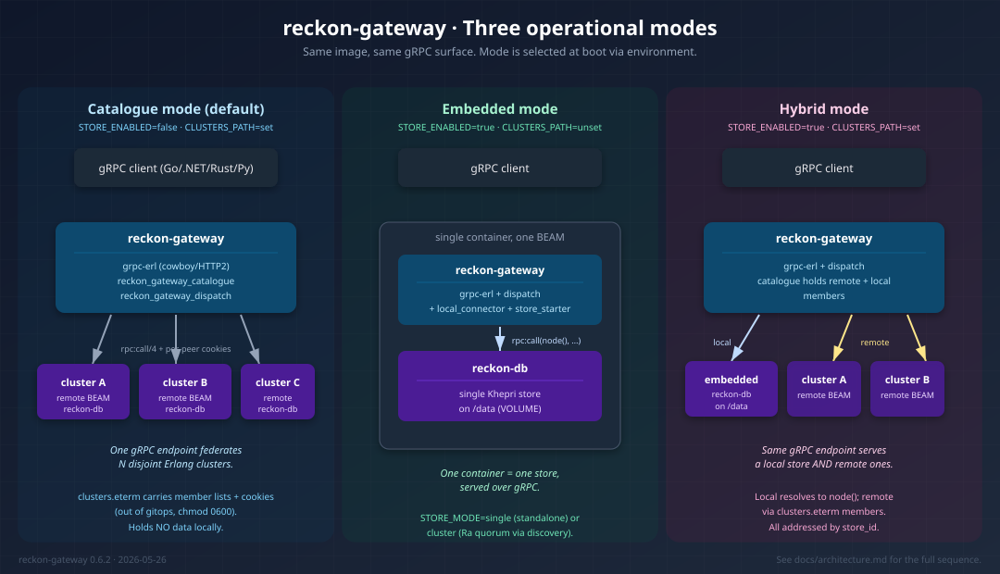

<p align="center">
  
</p>

<h1 align="center">reckon-gateway</h1>

<p align="center">
  <strong>gRPC ingress for <a href="https://codeberg.org/reckon-db-org/reckon-db">ReckonDB</a>.</strong><br/>
  Federate N remote Erlang clusters over one endpoint, or boot a local store in the same image.
</p>

<p align="center">
  <a href="https://codeberg.org/reckon-db-org/reckon-gateway/releases"></a>
  <a href="https://github.com/reckon-db-org/reckon-gateway/pkgs/container/reckon-gateway"></a>
  <a href="LICENSE"></a>
  
  <a href="https://buymeacoffee.com/rlefever"></a>
</p>

---

## What it is

`reckon-gateway` is a single OCI image that exposes the [ReckonDB](https://codeberg.org/reckon-db-org/reckon-db) event-store API over **two protocols at once**: gRPC (port `50051`) and an HTTP/JSON REST API (port `8080`). Polyglot clients (Go, .NET, Rust, Python) get the full feature surface without speaking Erlang dist; the HTTP port also serves a browser **admin UI** at `/admin` and a live event stream over SSE. Pick gRPC for typed high-throughput clients, REST for curl/browser/scripting.

Three operational modes, selected by environment at boot:

| Mode | `STORE_ENABLED` | `CLUSTERS_PATH` | Use case |
|---|---|---|---|
| **Catalogue** (default) | `false` | set | Federate N remote ReckonDB clusters over one gRPC endpoint. Gateway holds no data. |
| **Embedded** | `true` | unset | One container = one ReckonDB store, served over gRPC. |
| **Hybrid** | `true` | set | Local store **and** federated remote clusters from the same endpoint. |



## Quick start

### Pull the image

```bash
podman pull ghcr.io/reckon-db-org/reckon-gateway:0.17.1
```

### Run embedded (one container, one store)

```bash
podman run -d --name reckon-gw \
  -p 50051:50051 -p 8080:8080 \
  -v reckon-data:/data \
  -e RECKON_GATEWAY_STORE_ENABLED=true \
  -e RECKON_GATEWAY_STORE_ID=my_store \
  -e RECKON_GATEWAY_LOCAL_CLUSTER_ID=local \
  -e RECKON_GATEWAY_DIST_HIDDEN_FLAG=-hidden \
  ghcr.io/reckon-db-org/reckon-gateway:0.17.1
```

`50051` is gRPC; `8080` serves the REST API + admin UI (`http://localhost:8080/admin`).

### Run catalogue (federate remote clusters)

```bash
podman run -d --name reckon-gw \
  -p 50051:50051 -p 8080:8080 \
  -v /etc/reckon-gateway/clusters.eterm:/etc/reckon-gateway/clusters.eterm:ro \
  -e RECKON_GATEWAY_DIST_HIDDEN_FLAG=-hidden \
  ghcr.io/reckon-db-org/reckon-gateway:0.17.1
```

> Set `RECKON_GATEWAY_DIST_HIDDEN_FLAG=-hidden` for catalogue and embedded-single deployments so the gateway is invisible to peers' `nodes/0` and `pg` sync doesn't leak across cookie-disjoint clusters. **Leave empty** when running embedded `STORE_MODE=cluster` (gateway containers in a Ra quorum need mutual pg visibility). See [docs/env-contract.md#hidden-node-flag](docs/env-contract.md#hidden-node-flag).

See [docs/clusters-eterm.md](docs/clusters-eterm.md) for the `clusters.eterm` schema.

### Call from a client

```go
conn, _ := grpc.NewClient("localhost:50051", grpc.WithTransportCredentials(insecure.NewCredentials()))
client := streampb.NewStreamServiceClient(conn)

resp, _ := client.AppendEvents(ctx, &streampb.AppendEventsRequest{
    StoreId:         "my_store",
    StreamId:        "user-7c4b9...",
    ExpectedVersion: -1,
    Events: []*streampb.ProposedEvent{{
        EventType: "user_registered_v1",
        Data:      []byte(`{"name":"Alice"}`),
    }},
})
```

Full example: [docs/examples/go-quickstart.md](docs/examples/go-quickstart.md).

### Or call over HTTP/JSON (no protobuf needed)

```bash
# append
curl -sX POST localhost:8080/v1/stores/my_store/streams/user-7c4b9/events \
  -H 'content-type: application/json' \
  -d '{"expected_version":"any","events":[{"event_type":"user_registered_v1","data":{"name":"Alice"}}]}'
# → {"version":0,"count":1}

# read back
curl -s "localhost:8080/v1/stores/my_store/streams/user-7c4b9/events?from=0&limit=100"
```

Full HTTP reference: [docs/http-api.md](docs/http-api.md). Browser admin UI: [docs/admin-ui.md](docs/admin-ui.md).

## gRPC services

| Service | Description |
|---|---|
| `StreamService` | Append, read, list, delete event streams |
| `SubscriptionService` | Persistent server-streaming subscriptions |
| `SnapshotService` | Aggregate state snapshots |
| `TemporalService` | Time-based event queries |
| `SchemaService` | Event schema registration + upcasting |
| `AdminService` | Store inspection, scavenging, stream links |
| `StoresService` | Store enumeration via the catalogue |
| `HealthService` | Health checks, cluster diagnostics, memory pressure |
| `DcbService` | Dynamic Consistency Boundary: tag-filter conditional append + context read, DCB log/tag/event-type introspection, and CCC payload-index reads *(gRPC handlers since 0.14.0; requires reckon-db 5.4+ backing)* — see [docs/dcb-ccc.md](docs/dcb-ccc.md) and [the DCB guide](https://codeberg.org/reckon-db-org/reckon-db/src/branch/main/guides/dcb.md) |

Proto definitions are the source of truth and live in [reckon-proto](https://codeberg.org/reckon-db-org/reckon-proto). The gateway fetches them as a rebar3 dep at build time.

## HTTP/JSON API + admin UI

The same feature surface is served over plain HTTP on port `8080` (`RECKON_GATEWAY_HTTP_PORT`), for clients that don't want to generate protobuf stubs:

| Path prefix | What |
|---|---|
| `GET /v1/health`, `/v1/health/:store`, `/v1/server-info/:store` | Liveness + version/integrity info |
| `GET /v1/stores`, `/v1/stores/:store` | Store discovery via the catalogue |
| `* /v1/stores/:store/streams/...` | Append, read, list, delete, version |
| `GET /v1/stores/:store/events/by-type\|by-tags\|by-metadata\|global` | Cross-stream indexed reads |
| `* /v1/stores/:store/dcb/...` | DCB context/append/log/tags/event-types + CCC by-payload(-hash)/payload-indexes |
| `GET /v1/admin/events` | Live catalogue/cluster status over Server-Sent Events |
| `GET /admin` | Browser admin UI (stores, streams, DCB/CCC query views) |

Full reference: **[docs/http-api.md](docs/http-api.md)**, **[docs/admin-ui.md](docs/admin-ui.md)**, **[docs/dcb-ccc.md](docs/dcb-ccc.md)**.

## Documentation

Full index: **[docs/README.md](docs/README.md)** , audience-grouped, with suggested reading orders.

Quick jumps:

- [Architecture](docs/architecture.md)
- [Environment contract](docs/env-contract.md) (incl. `RECKON_GATEWAY_HTTP_PORT`, `RECKON_GATEWAY_DIST_HIDDEN_FLAG`)
- [HTTP/JSON API reference](docs/http-api.md)
- [Admin UI + SSE](docs/admin-ui.md)
- [DCB + CCC queries](docs/dcb-ccc.md)
- [Embedded mode](docs/embedded-mode.md)
- [`store.eterm` reference](docs/store-config.md) (tune the hosted store; declare CCC payload indexes)
- [`clusters.eterm` reference](docs/clusters-eterm.md)
- [Building from source](docs/building.md)
- [Go client quick start](docs/examples/go-quickstart.md)

## Versioning

| Component | Version (2026-06) |
|---|---|
| `reckon_gateway` | 0.17.1 |
| `reckon_gater` (deps) | ~> 3.6 |
| `reckon_db` (deps, opt) | ~> 5.4 |
| `reckon_proto` (deps) | v0.8.0 |
| Erlang/OTP | 27+ |

Pin to the semver tag (`:0.17.1`) for reproducible deploys; `:latest` tracks `main`.

## License

Apache-2.0 , see [LICENSE](LICENSE).
